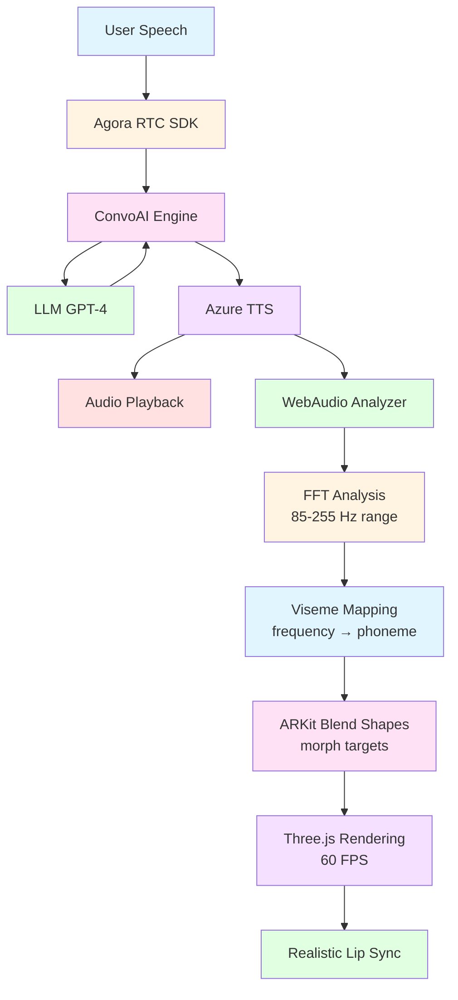

# Build Real-Time AI Avatars with Lip Sync Using Agora ConvoAI

When I set out to build a conversational AI, I wasn't interested in another chatbot with a static avatar. I wanted something that felt real—an AI that speaks with synchronized lip movements, shows natural expressions, and responds in genuine real-time. After months of experimentation combining WebAudio analysis, ReadyPlayer.me avatars, and Agora's ConvoAI platform, I figured it out.

This guide shows you how to implement real-time lip synchronization and facial expressions for 3D avatars powered by Agora's ConvoAI Engine. You'll learn to analyze audio streams with WebAudio API, map frequencies to ARKit viseme blend shapes, and render expressive avatars at 60 FPS using Three.js—all synchronized with Agora's voice streaming.

## Understand the tech

The breakthrough here is using WebAudio API to analyze Agora's audio stream in real-time, then mapping frequency data directly to ARKit viseme blend shapes on a ReadyPlayer.me avatar. Here's the flow:

1. **User speaks** → Agora RTC captures and streams audio to ConvoAI Engine
2. **ConvoAI processes** → Speech-to-text, LLM reasoning, text-to-speech conversion
3. **AI responds** → TTS audio streams back through Agora RTC
4. **WebAudio analyzes** → AnalyserNode performs FFT on audio stream (85-255 Hz speech range)
5. **Viseme mapping** → Frequency patterns map to phoneme shapes (aa, E, I, O, U, PP, FF, etc.)
6. **Morph targets update** → ARKit blend shapes deform at 60 FPS
7. **Avatar speaks** → Realistic lip sync with <50ms audio-to-visual latency

Here's the data flow:



The key insight? Human speech frequencies cluster in predictable ranges. Low frequencies (85-150 Hz) correspond to open vowels like "O" and "U". Mid-range (150-200 Hz) maps to "A" sounds. Higher frequencies (200-255 Hz) indicate "E" and "I" sounds. Consonants create distinct spikes we detect and map to specific blend shapes (PP for bilabials, FF for labiodentals, TH for dentals, etc.).

This approach delivers convincing lip sync without machine learning models, pre-processing, or phoneme detection APIs. It's pure browser-native audio analysis driving real-time 3D deformation.

## Prerequisites

To build real-time AI avatars with lip sync using Agora, you must have:

- A valid [Agora account](https://console.agora.io/). If you don't have one, see [Get Started with Agora](https://www.agora.io/en/blog/how-to-get-started-with-agora?utm_source=medium&utm_medium=blog&utm_campaign=Build_RealTime_AI_Avatars_with_Lip_Sync_Using_Agora_ConvoAI)
- An Agora App ID and temporary token from the [Agora Console](https://console.agora.io/)
- Agora ConvoAI API credentials (API key and password)
- [Node.js](https://nodejs.org/) 16+ and npm installed
- Basic knowledge of [JavaScript and React](https://react.dev/)
- An [OpenAI API key](https://platform.openai.com/) or compatible LLM API
- [Azure Speech Services API key](https://portal.azure.com/) for text-to-speech
- A modern web browser with WebAudio API support (Chrome, Firefox, Safari, Edge)

## Project setup

To set up your development environment for building AI avatars with lip sync:

1. Clone the starter repository:
   ```bash
   git clone https://github.com/AgoraIO-Community/RPM-agora-agent.git
   cd RPM-agora-agent
   ```

2. Install dependencies:
   ```bash
   npm install
   ```

The project structure includes:

```
RPM-agora-agent/
├── src/
│   ├── components/
│   │   ├── Avatar.jsx          # 3D avatar with lip sync engine
│   │   ├── Experience.jsx      # Three.js scene configuration
│   │   ├── UI.jsx             # Main user interface
│   │   ├── Settings.jsx       # API credentials panel
│   │   └── CombinedChat.jsx   # Chat interface
│   ├── hooks/
│   │   ├── useAgora.jsx       # Agora RTC integration
│   │   ├── useChat.jsx        # ConvoAI state management
│   │   └── useLipSync.jsx     # Lip sync audio analysis
│   ├── App.jsx                # Root component
│   └── main.jsx              # Application entry point
├── public/
│   └── models/
│       └── Avatars/          # ReadyPlayer.me GLB files
└── package.json
```

3. Start the development server:
   ```bash
   npm run dev
   ```

4. Open your browser to `http://localhost:5173`

You'll see the application UI with a settings button in the top-right corner. Before we can test the avatar, you need to configure your API credentials, which we'll do in the next section.

## Build AI Avatar with Lip Sync

Building this system involves three core modules: initializing Agora RTC with ConvoAI, implementing the WebAudio-driven lip sync engine, and integrating facial expressions. Let's build each incrementally.

### Initialize Agora RTC and ConvoAI

First, we need to establish the real-time voice connection that will power our AI agent.

1. **Configure your API credentials**

   Open the application in your browser. Click the settings (☰) button in the top-right corner and enter your credentials in each tab:

   - **Agora Tab**: App ID, Token (from console), Channel Name
   - **ConvoAI Tab**: API Base URL, API Key, Password, Agent Name, Agent UID  
   - **LLM Tab**: OpenAI API URL, API Key, Model (gpt-4o-mini), System Message
   - **TTS Tab**: Azure Speech API Key, Region (eastus), Voice Name (en-US-AriaNeural)
   - **ASR Tab**: Language (en-US)

   Settings persist in sessionStorage during your session.

2. **Initialize the Agora RTC client**

   In `src/hooks/useAgora.jsx`, we create and configure the Agora client:

   ```javascript
   import AgoraRTC from "agora-rtc-sdk-ng";

   // Create Agora RTC client instance
   const client = AgoraRTC.createClient({
     mode: "rtc",  // Real-time communication mode
     codec: "vp8"  // Video codec (we'll use audio only)
   });

   // Initialize state for tracks
   const [localAudioTrack, setLocalAudioTrack] = useState(null);
   const [remoteAudioTrack, setRemoteAudioTrack] = useState(null);
   ```

3. **Join the Agora channel**

   Connect to the channel where the AI agent will communicate:

   ```javascript
   const joinChannel = async (appId, token, channelName) => {
     try {
       // Join the channel with your Agora App ID
       // UID null means Agora will auto-assign a unique ID
       const uid = await client.join(appId, channelName, token, null);
       console.log("Joined channel with UID:", uid);

       // Create and publish local microphone audio track
       const audioTrack = await AgoraRTC.createMicrophoneAudioTrack({
         encoderConfig: "speech_standard",  // Optimized for voice
         AEC: true,   // Acoustic Echo Cancellation
         ANS: true,   // Automatic Noise Suppression
         AGC: true    // Automatic Gain Control
       });

       // Publish the track so the AI agent can hear you
       await client.publish([audioTrack]);
       setLocalAudioTrack(audioTrack);
       
       console.log("Published local audio track");
       return uid;
     } catch (error) {
       console.error("Failed to join channel:", error);
       throw error;
     }
   };
   ```

4. **Subscribe to remote audio (the AI agent's voice)**

   Listen for when the AI agent publishes audio and set up our lip sync system:

   ```javascript
   // Event handler for when a remote user publishes media
   client.on("user-published", async (user, mediaType) => {
     if (mediaType === "audio") {
       // Subscribe to the remote user's audio track
       await client.subscribe(user, mediaType);
       console.log("Subscribed to remote audio from UID:", user.uid);

       // Get the remote audio track
       const remoteTrack = user.audioTrack;
       setRemoteAudioTrack(remoteTrack);

       // Play the audio so we can hear the AI agent
       remoteTrack.play();

       // CRITICAL: Get the MediaStreamTrack for WebAudio analysis
       // This is what enables our lip sync system
       const mediaStreamTrack = remoteTrack.getMediaStreamTrack();
       
       // Initialize lip sync with this audio stream
       // We'll implement setupLipSync() in the next module
       setupLipSync(mediaStreamTrack);
     }
   });
   ```

5. **Handle disconnections**

   Clean up resources when users leave:

   ```javascript
   client.on("user-unpublished", (user, mediaType) => {
     if (mediaType === "audio") {
       console.log("Remote user unpublished audio:", user.uid);
       setRemoteAudioTrack(null);
       // Stop lip sync when audio ends
       stopLipSync();
     }
   });
   ```

6. **Leave the channel**

   Implement cleanup when closing the application:

   ```javascript
   const leaveChannel = async () => {
     // Stop and close local audio track
     if (localAudioTrack) {
       localAudioTrack.stop();
       localAudioTrack.close();
       setLocalAudioTrack(null);
     }

     // Unpublish and leave the channel
     await client.unpublish();
     await client.leave();
     
     console.log("Left channel");
   };
   ```

At this point, you have a working Agora RTC connection. You can join a channel, publish your microphone audio, and receive audio from the AI agent. Next, we'll analyze that audio stream to drive lip sync.

### Implement WebAudio-Driven Lip Sync Engine

This is where the magic happens. We'll use WebAudio API to analyze the AI agent's voice in real-time and map it to mouth movements.

1. **Create the WebAudio analyzer**

   In `src/hooks/useLipSync.jsx`, set up the audio analysis infrastructure:

   ```javascript
   import { useRef, useEffect } from 'react';

   export const useLipSync = () => {
     // Store WebAudio components
     const audioContextRef = useRef(null);
     const analyzerRef = useRef(null);
     const dataArrayRef = useRef(null);

     const setupLipSync = (mediaStreamTrack) => {
       // Create AudioContext (browser's audio processing engine)
       const audioContext = new (window.AudioContext || window.webkitAudioContext)();
       audioContextRef.current = audioContext;

       // Create an AnalyserNode for frequency analysis
       const analyzer = audioContext.createAnalyser();
       
       // FFT size determines frequency resolution
       // 1024 gives us good balance between accuracy and performance
       analyzer.fftSize = 1024;
       
       // Smooth transitions between frames (0 = no smoothing, 1 = maximum)
       analyzer.smoothingTimeConstant = 0.3;
       
       analyzerRef.current = analyzer;

       // Create array to hold frequency data
       // frequencyBinCount is half of fftSize
       const bufferLength = analyzer.frequencyBinCount;
       const dataArray = new Uint8Array(bufferLength);
       dataArrayRef.current = dataArray;

       // Convert MediaStreamTrack to MediaStream
       const stream = new MediaStream([mediaStreamTrack]);
       
       // Create source from the stream
       const source = audioContext.createMediaStreamSource(stream);
       
       // Connect source to analyzer
       source.connect(analyzer);
       
       console.log("Lip sync initialized with FFT size:", analyzer.fftSize);
     };

     return { setupLipSync };
   };
   ```

2. **Analyze speech frequencies**

   Add a function to extract audio levels from the speech frequency range:

   ```javascript
   const getAudioLevel = () => {
     if (!analyzerRef.current || !dataArrayRef.current) {
       return 0;  // No audio if not initialized
     }

     const analyzer = analyzerRef.current;
     const dataArray = dataArrayRef.current;

     // Get current frequency data
     // This fills dataArray with values 0-255 for each frequency bin
     analyzer.getByteFrequencyData(dataArray);

     // Human speech primarily lives in 85-255 Hz
     // With fftSize=1024 and 44.1kHz sample rate:
     // - Each bin represents ~43 Hz
     // - Bin 2-6 covers our speech range
     const speechRange = dataArray.slice(2, 6);

     // Calculate average amplitude in speech range
     const sum = speechRange.reduce((a, b) => a + b, 0);
     const average = sum / speechRange.length;

     // Normalize to 0-1 range
     return average / 255;
   };
   ```

3. **Map frequencies to visemes**

   Create the mapping from audio characteristics to mouth shapes:

   ```javascript
   const calculateViseme = (audioLevel) => {
     if (audioLevel < 0.01) {
       // Silence - neutral mouth position
       return { viseme: 'neutral', weight: 0 };
     }

     // Get more detailed frequency data for viseme detection
     const analyzer = analyzerRef.current;
     const dataArray = dataArrayRef.current;
     analyzer.getByteFrequencyData(dataArray);

     // Analyze different frequency ranges to determine phoneme
     const lowFreq = dataArray.slice(2, 4);    // 85-170 Hz - O, U sounds
     const midFreq = dataArray.slice(4, 5);    // 170-213 Hz - A sounds  
     const highFreq = dataArray.slice(5, 6);   // 213-255 Hz - E, I sounds

     const lowAvg = lowFreq.reduce((a,b) => a+b) / lowFreq.length / 255;
     const midAvg = midFreq.reduce((a,b) => a+b) / midFreq.length / 255;
     const highAvg = highFreq.reduce((a,b) => a+b) / highFreq.length / 255;

     // Determine dominant frequency range
     let viseme = 'viseme_aa';  // Default to neutral vowel
     let weight = audioLevel;

     if (lowAvg > midAvg && lowAvg > highAvg) {
       // Low frequencies dominant - round vowels
       viseme = audioLevel > 0.3 ? 'viseme_O' : 'viseme_U';
     } else if (highAvg > midAvg && highAvg > lowAvg) {
       // High frequencies dominant - close vowels
       viseme = audioLevel > 0.3 ? 'viseme_I' : 'viseme_E';
     } else {
       // Mid frequencies - open vowels
       viseme = 'viseme_aa';
     }

     return { viseme, weight: Math.min(weight * 1.5, 1.0) };
   };
   ```

4. **Export the analysis function**

   Make the audio level and viseme data available to our Avatar component:

   ```javascript
   return {
     setupLipSync,
     getAudioLevel,
     calculateViseme,
     stopLipSync: () => {
       if (audioContextRef.current) {
         audioContextRef.current.close();
         audioContextRef.current = null;
         analyzerRef.current = null;
         dataArrayRef.current = null;
       }
     }
   };
   ```

Now we have a working lip sync engine that analyzes audio and determines what mouth shape should be displayed. Next, we'll connect this to the 3D avatar to actually see the results.

### Integrate Avatar and Apply Morph Targets

Now we connect our audio analysis to the 3D avatar's facial blend shapes.

1. **Load the ReadyPlayer.me avatar**

   In `src/components/Avatar.jsx`, load the 3D model with morph targets:

   ```javascript
   import { useGLTF } from '@react-three/drei';
   import { useFrame } from '@react-three/fiber';
   import { useRef, useEffect } from 'react';

   export function Avatar({ currentAvatar, lipSyncData }) {
     // Load the GLB file from ReadyPlayer.me
     const { scene, nodes } = useGLTF(`/models/Avatars/${currentAvatar}.glb`);
     
     // Reference to the head mesh (contains morph targets)
     const headRef = useRef();

     useEffect(() => {
       if (nodes.Wolf3D_Head) {
         headRef.current = nodes.Wolf3D_Head;
         
         // Log available morph targets for debugging
         console.log('Available morph targets:', 
           Object.keys(nodes.Wolf3D_Head.morphTargetDictionary)
         );
       }
     }, [nodes]);

     // Render the avatar
     return (
       <primitive object={scene} scale={1.5} position={[0, -1.5, 0]} />
     );
   }
   ```

2. **Apply lip sync to morph targets**

   Update the morph target influences based on audio analysis:

   ```javascript
   useFrame(() => {
     if (!headRef.current || !lipSyncData) return;

     const { viseme, weight } = lipSyncData;
     const morphTargetInfluences = headRef.current.morphTargetInfluences;
     const morphTargetDictionary = headRef.current.morphTargetDictionary;

     // Get the index for the current viseme
     const visemeIndex = morphTargetDictionary[viseme];
     
     if (visemeIndex === undefined) return;

     // Smooth interpolation (lerp) from current value to target
     // This creates natural transitions between mouth shapes
     const current = morphTargetInfluences[visemeIndex] || 0;
     const target = weight;
     const lerpFactor = 0.3;  // Smoothing speed (0-1)

     // Apply the interpolated value
     morphTargetInfluences[visemeIndex] = 
       current + (target - current) * lerpFactor;

     // Gradually return other visemes to neutral
     for (let i = 0; i < morphTargetInfluences.length; i++) {
       if (i !== visemeIndex && morphTargetInfluences[i] > 0) {
         // Decay to 0
         morphTargetInfluences[i] *= 0.7;
       }
     }
   });
   ```

3. **Add facial expressions**

   Implement expression controls that work alongside lip sync:

   ```javascript
   const [expression, setExpression] = useState('default');

   // Expression presets using ARKit blend shapes
   const expressions = {
     default: {},
     smile: {
       mouthSmile: 0.8,
       eyeSquintLeft: 0.2,
       eyeSquintRight: 0.2
     },
     surprised: {
       browInnerUp: 0.9,
       eyeWideLeft: 0.8,
       eyeWideRight: 0.8,
       jawOpen: 0.3
     },
     sad: {
       mouthFrownLeft: 0.6,
       mouthFrownRight: 0.6,
       browInnerUp: 0.3
     }
   };

   // Apply expression to morph targets
   const applyExpression = (expressionName) => {
     if (!headRef.current) return;

     const morphTargetInfluences = headRef.current.morphTargetInfluences;
     const morphTargetDictionary = headRef.current.morphTargetDictionary;
     const targetExpression = expressions[expressionName] || {};

     // Apply each blend shape in the expression
     Object.entries(targetExpression).forEach(([shapeName, targetValue]) => {
       const shapeIndex = morphTargetDictionary[shapeName];
       if (shapeIndex !== undefined) {
         morphTargetInfluences[shapeIndex] = targetValue;
       }
     });
   };

   // Apply expression when it changes
   useEffect(() => {
     applyExpression(expression);
   }, [expression]);
   ```

4. **Combine lip sync and expressions**

   Ensure lip sync movements add to expressions rather than replacing them:

   ```javascript
   useFrame(() => {
     if (!headRef.current || !lipSyncData) return;

     const { viseme, weight } = lipSyncData;
     const morphTargetInfluences = headRef.current.morphTargetInfluences;
     const morphTargetDictionary = headRef.current.morphTargetDictionary;

     const visemeIndex = morphTargetDictionary[viseme];
     if (visemeIndex === undefined) return;

     // Get current expression value for this blend shape
     const expressionValue = morphTargetInfluences[visemeIndex] || 0;

     // Calculate lip sync value with smoothing
     const current = morphTargetInfluences[visemeIndex] || 0;
     const lipSyncTarget = weight;
     const lipSyncValue = current + (lipSyncTarget - current) * 0.3;

     // CRITICAL: Use Math.max() to additively blend
     // This ensures lip sync doesn't reduce expression intensity
     morphTargetInfluences[visemeIndex] = Math.max(expressionValue, lipSyncValue);

     // Decay other visemes that aren't part of current expression
     for (let i = 0; i < morphTargetInfluences.length; i++) {
       if (i !== visemeIndex) {
         const isPartOfExpression = Object.keys(expressions[expression] || {})
           .some(key => morphTargetDictionary[key] === i);
         
         if (!isPartOfExpression && morphTargetInfluences[i] > 0) {
           morphTargetInfluences[i] *= 0.7;
         }
       }
     }
   });
   ```

5. **Connect to ConvoAI state**

   In your main `App.jsx`, wire everything together:

   ```javascript
   import { Avatar } from './components/Avatar';
   import { useAgora } from './hooks/useAgora';
   import { useLipSync } from './hooks/useLipSync';
   import { useState } from 'react';
   import { Canvas } from '@react-three/fiber';

   function App() {
     const { joinChannel, leaveChannel } = useAgora();
     const { setupLipSync, calculateViseme, getAudioLevel } = useLipSync();
     const [lipSyncData, setLipSyncData] = useState(null);
     const [isConnected, setIsConnected] = useState(false);

     // Update lip sync data in animation loop
     useEffect(() => {
       if (!isConnected) return;

       const interval = setInterval(() => {
         const audioLevel = getAudioLevel();
         const visemeData = calculateViseme(audioLevel);
         setLipSyncData(visemeData);
       }, 16);  // ~60 FPS

       return () => clearInterval(interval);
     }, [isConnected]);

     const handleConnect = async () => {
       await joinChannel(appId, token, channelName);
       setIsConnected(true);
     };

     return (
       <div className="app">
         <Canvas camera={{ position: [0, 0, 3], fov: 50 }}>
           <Avatar 
             currentAvatar="Aurora" 
             lipSyncData={lipSyncData}
           />
           <ambientLight intensity={0.5} />
           <directionalLight position={[5, 5, 5]} intensity={1} />
         </Canvas>
         
         <button onClick={handleConnect}>
           {isConnected ? 'Connected' : 'Connect'}
         </button>
       </div>
     );
   }
   ```

You now have a complete system that:
- Connects to Agora RTC and receives AI agent audio
- Analyzes audio frequencies with WebAudio API
- Maps frequencies to visemes
- Updates avatar morph targets at 60 FPS
- Blends lip sync with facial expressions

The complete implementation is in the GitHub repository at [github.com/AgoraIO-Community/RPM-agora-agent](https://github.com/AgoraIO-Community/RPM-agora-agent).

## Test AI Avatar with Lip Sync

To verify your implementation works correctly:

1. **Start the application**
   ```bash
   npm run dev
   ```

2. **Configure credentials**
   - Click the settings (☰) button
   - Enter all API credentials in their respective tabs
   - Ensure Agora App ID and token are valid (tokens expire every 24 hours)

3. **Connect to the channel**
   - Click the "Connect" button in the UI
   - You should see "Connected" status in the console
   - The avatar should load and display

4. **Test speech-to-avatar synchronization**
   - Speak into your microphone: "Hello, can you hear me?"
   - The AI agent should respond with synthesized speech
   - Observe the avatar's mouth movements:
     - Mouth should open and close in sync with audio
     - Different phonemes should produce different mouth shapes
     - Transitions should be smooth, not jerky

5. **Verify frequency mapping**
   - Open browser DevTools → Console
   - Look for log messages showing audio levels
   - When AI speaks, you should see values > 0.01
   - When silent, values should be near 0

6. **Test expressions**
   - Use the expression buttons in the UI
   - Avatar should transition to new expression
   - Lip sync should continue working on top of expression
   - Expression should not "fight" with lip movements

7. **Check performance**
   - Open DevTools → Performance tab
   - Record while AI is speaking
   - Frame rate should maintain 60 FPS
   - If dropping below 30 FPS, reduce `fftSize` to 512

Common issues:
- **Avatar mouth not moving**: Check WebAudio permissions, verify remote audio track is playing
- **Jerky animations**: Increase `smoothingTimeConstant` to 0.5-0.8
- **Wrong mouth shapes**: Adjust frequency bin ranges in `calculateViseme()`
- **No audio**: Verify Agora token hasn't expired, check microphone permissions

## Next Steps

You've successfully built a real-time AI avatar with lip sync powered by Agora ConvoAI! You now understand how to:
- Integrate Agora RTC for real-time voice streaming
- Analyze audio frequencies with WebAudio API
- Map speech patterns to visemes
- Animate 3D avatars with morph targets
- Blend lip sync with facial expressions

The complete source code is available on [GitHub](https://github.com/AgoraIO-Community/RPM-agora-agent).

### Enhance your implementation

- **Add emotion detection**: Use Agora's ConvoAI skip patterns to embed emotion markers in LLM responses and trigger expressions automatically
- **Improve viseme accuracy**: Fine-tune frequency ranges for different languages and accents
- **Optimize for mobile**: Reduce polygon count and texture resolution for mobile devices
- **Add gesture system**: Extend to body animations synchronized with speech rhythm
- **Multi-language support**: Adjust viseme mappings for non-English phonemes

### Resources

- [Agora ConvoAI Documentation](https://docs.agora.io/en/conversational-ai/overview/product-overview)
- [Agora RTC Web SDK Reference](https://docs.agora.io/en/voice-calling/reference/api)
- [ReadyPlayer.me Documentation](https://docs.readyplayer.me/)
- [WebAudio API Guide](https://developer.mozilla.org/en-US/docs/Web/API/Web_Audio_API)
- [Three.js Morph Targets](https://threejs.org/docs/#api/en/core/BufferGeometry.morphAttributes)
- Join the [Agora Developer Community](https://www.agora.io/en/join-slack/)

---

*Built with ❤️ using Agora ConvoAI, ReadyPlayer.me, and WebAudio API*  
*Questions? Open an issue on [GitHub](https://github.com/AgoraIO-Community/RPM-agora-agent/issues)*
