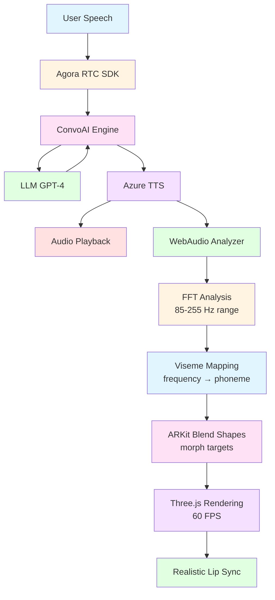

# Build Real-Time AI Avatars with Lip Sync Using Agora ConvoAI

When I set out to build a conversational AI, I wasn't interested in another chatbot with a static avatar. I wanted something that felt real—an AI that speaks with synchronized lip movements, shows natural expressions, and responds in genuine real-time. After months of experimentation combining WebAudio analysis, ReadyPlayer.me avatars, and Agora's ConvoAI platform, I figured it out.

This guide shows you how to implement real-time lip synchronization and facial expressions for 3D avatars powered by Agora's ConvoAI Engine. You'll learn to analyze audio streams with WebAudio API, map frequencies to ARKit viseme blend shapes, and render expressive avatars at 60 FPS using Three.js—all synchronized with Agora's voice streaming.

## Understand the tech

The breakthrough here is using WebAudio API to analyze Agora's audio stream in real-time, then mapping frequency data directly to ARKit viseme blend shapes on a ReadyPlayer.me avatar. Here's the flow:

1. **User speaks** → Agora RTC captures and streams audio to ConvoAI Engine
2. **ConvoAI processes** → Speech-to-text, LLM reasoning, text-to-speech conversion
3. **AI responds** → TTS audio streams back through Agora RTC
4. **WebAudio analyzes** → AnalyserNode performs FFT on audio stream (85-255 Hz speech range)
5. **Viseme mapping** → Frequency patterns map to phoneme shapes (aa, E, I, O, U, PP, FF, etc.)
6. **Morph targets update** → ARKit blend shapes deform at 60 FPS
7. **Avatar speaks** → Realistic lip sync with <50ms audio-to-visual latency

Here's the data flow:



The key insight? Human speech frequencies cluster in predictable ranges. Low frequencies (85-150 Hz) correspond to open vowels like "O" and "U". Mid-range (150-200 Hz) maps to "A" sounds. Higher frequencies (200-255 Hz) indicate "E" and "I" sounds. Consonants create distinct spikes we detect and map to specific blend shapes (PP for bilabials, FF for labiodentals, TH for dentals, etc.).

This approach delivers convincing lip sync without machine learning models, pre-processing, or phoneme detection APIs. It's pure browser-native audio analysis driving real-time 3D deformation.

## Prerequisites

To build real-time AI avatars with lip sync using Agora, you must have:

- A valid [Agora account](https://console.agora.io/). If you don't have one, see [Get Started with Agora](https://www.agora.io/en/blog/how-to-get-started-with-agora?utm_source=medium&utm_medium=blog&utm_campaign=Build_RealTime_AI_Avatars_with_Lip_Sync_Using_Agora_ConvoAI)
- An Agora App ID and temporary token from the [Agora Console](https://console.agora.io/restful-api)
- Agora ConvoAI API credentials ("Customer ID" and "Customer Secret")
- [Node.js](https://nodejs.org/) 20+ (LTS) and npm installed
- Basic knowledge of [JavaScript and React](https://react.dev/)
- An [OpenAI API key](https://platform.openai.com/) or compatible LLM API
- [Azure Speech Services API key](https://portal.azure.com/) for text-to-speech
- A modern web browser with WebAudio API support (Chrome, Firefox, Safari, Edge)

## Project setup

To set up your development environment for building AI avatars with lip sync:

1. Clone the starter repository:
   ```bash
   git clone https://github.com/AgoraIO-Community/RPM-agora-agent.git
   cd RPM-agora-agent
   ```

2. Install dependencies:
   ```bash
   npm install
   ```

The project structure includes:

```
RPM-agora-agent/
├── src/
│   ├── components/
│   │   ├── Avatar.jsx          # 3D avatar with lip sync engine
│   │   ├── Experience.jsx      # Three.js scene configuration
│   │   ├── UI.jsx             # Main user interface
│   │   ├── Settings.jsx       # API credentials panel
│   │   └── CombinedChat.jsx   # Chat interface
│   ├── hooks/
│   │   ├── useAgora.jsx       # Agora RTC integration
│   │   ├── useChat.jsx        # ConvoAI state management
│   │   └── useLipSync.jsx     # Lip sync audio analysis
│   ├── App.jsx                # Root component
│   └── main.jsx              # Application entry point
├── public/
│   └── models/
│       └── Avatars/          # ReadyPlayer.me GLB files
└── package.json
```

3. Start the development server:
   ```bash
   npm run dev
   ```

4. Open your browser to `http://localhost:5173`

You'll see the application UI with a settings button in the top-right corner. Before we can test the avatar, you need to configure your API credentials, which we'll do in the next section.

## Understand How the AI Avatar Works

This section walks through the key components of the implementation. The system consists of three core modules: initializing Agora RTC with ConvoAI, implementing the WebAudio-driven lip sync engine, and integrating facial expressions. Each module is already implemented in the codebase—we'll examine how they work together to create the real-time AI avatar experience.

### Initialize Agora RTC and ConvoAI

First, we need to establish the real-time voice connection that will power our AI agent.

1. **Configure your API credentials**

   Open the application in your browser. Click the settings (☰) button in the top-right corner and enter your credentials in each tab:

   - **Agora Tab**: App ID, Token (from console), Channel Name
   - **ConvoAI Tab**: API Base URL, API Key, Password, Agent Name, Agent UID  
   - **LLM Tab**: OpenAI API URL, API Key, Model (gpt-4o-mini), System Message
   - **TTS Tab**: Azure Speech API Key, Region (eastus), Voice Name (en-US-AriaNeural)
   - **ASR Tab**: Language (en-US)

   Settings persist in sessionStorage during your session.

2. **Initialize the Agora RTC client**

   In `src/hooks/useAgora.jsx`, the client is created in 'live' mode with 'host' role to enable immediate two-way communication with the ConvoAI Agent.

   ```javascript
   import AgoraRTC from "agora-rtc-sdk-ng";

   // Create Agora RTC client in LIVE mode for better audio handling
   const agoraClient = AgoraRTC.createClient({ 
     mode: 'live',
     codec: 'vp8' 
   });

   // Set client role to host for publishing audio
   await agoraClient.setClientRole('host');
   ```

3. **Join the Agora channel**

   Create the microphone track, join the channel, and publish the audio. Since we're already in host role, we can immediately publish audio for the ASR → LLM pipeline.

   ```javascript
   const joinChannel = async () => {
     // Create local audio track with 48kHz sample rate
     const audioTrack = await AgoraRTC.createMicrophoneAudioTrack({
       encoderConfig: {
         sampleRate: 48000,
         stereo: false,
         bitrate: 128,
       }
     });
     setLocalAudioTrack(audioTrack);
     
     // Join the channel
     await client.join(
       agoraConfig.appId,
       agoraConfig.channel,
       agoraConfig.token,
       agoraConfig.uid
     );
     
     // Publish local audio track (already in host role)
     await client.publish([audioTrack]);
     
     setIsJoined(true);
     
     // Start ConvoAI Agent via REST API
     await startConvoAIAgent();
   };
   ```

   > **Note**: See the complete implementation in [`useAgora.jsx` lines 1075-1155](https://github.com/AgoraIO-Community/RPM-agora-agent/blob/main/src/hooks/useAgora.jsx#L1075-L1155) which includes error handling and validation.

4. **Start the ConvoAI Agent to join the channel**

   This is the critical step that makes the AI agent join the same Agora channel. We call the ConvoAI REST API: The demo lets you save the connection configurations as part of bring your own keys, to local environment variables once added in the settings menu, thery are split into 'agoraConfig' related to the RESTFUL API access, and 'convoaiConfig' that are related to the ASR/STT, LLM, and TTS settings need to initiate ConvoAI restful API. 

   ```javascript
   const startConvoAIAgent = async () => {
     const agoraConfig = getAgoraConfig();
     const convoaiConfig = getConvoAIConfig();
     
     // Generate unique name for this agent session
     const uniqueName = `agora-agent-${Date.now()}`;
     
     // ConvoAI API endpoint: POST /projects/{appId}/join
     const apiUrl = `${convoaiConfig.baseUrl}/projects/${agoraConfig.appId}/join`;
     
     // Request body with all configuration
     const requestBody = {
       "name": uniqueName,
       "properties": {
         "channel": agoraConfig.channel,
         "token": agoraConfig.token,
         "name": convoaiConfig.agentName,
         "agent_rtc_uid": convoaiConfig.agentUid.toString(),
         "remote_rtc_uids": ["*"], // Listen to all users
         "idle_timeout": 120,
         "llm": {
           "url": convoaiConfig.llmUrl,
           "api_key": convoaiConfig.llmApiKey,
           "system_messages": [{
             "role": "system",
             "content": convoaiConfig.systemMessage
           }],
           "max_history": 32,
           "greeting_message": convoaiConfig.greeting,
           "params": {
             "model": convoaiConfig.llmModel
           }
         },
         "tts": {
           "vendor": "microsoft",
           "params": {
             "key": convoaiConfig.ttsApiKey,
             "region": convoaiConfig.ttsRegion,
             "voice_name": convoaiConfig.ttsVoiceName
           }
         },
         "asr": {
           "language": convoaiConfig.asrLanguage
         }
       }
     };
     
     // Make the API call with Basic Auth
     const response = await fetch(apiUrl, {
       method: 'POST',
       headers: {
         'Content-Type': 'application/json',
         'Authorization': generateBasicAuthHeader(),
       },
       body: JSON.stringify(requestBody),
     });
     
     if (!response.ok) {
       const errorText = await response.text();
       throw new Error(`ConvoAI API Error (${response.status}): ${errorText}`);
     }
     
     const result = await response.json();
     
     // Store the agent ID for cleanup later
     setAgentId(result.agent_id || result.id);
     
     return result;
   };
   ```

When the ConvoAI Engine receives this request, it creates an AI agent instance with the specified UID that joins your Agora channel as a remote user. The agent listens to audio from users and converts speech to text using ASR, processes the input with the LLM (OpenAI GPT-4), generates a response, and converts it back to speech using Azure TTS. The agent's audio is then published to the channel with the specified `agent_rtc_uid`, allowing your application to receive and play the AI's voice response.

   > **Note**: See the complete implementation in [`useAgora.jsx` lines 906-1020](https://github.com/AgoraIO-Community/RPM-agora-agent/blob/main/src/hooks/useAgora.jsx#L906-L1020) with full error handling and logging.

5. **Subscribe to remote audio (the AI agent's voice)**

   The event handler subscribes to the remote user and sets up lip sync if it's the ConvoAI agent: Since the Agent is hosted in the Agora cloud, it does join like any oher remote users with a UID and joins the channle usihg the credentials we pass, and the human users need to subscribe to the Agent UID, here we check if the media type is Audio, and is the UID matches the AgentID we have given as part of the Start API call, if so we play, and create a mediaStreamTrack that is used to create audiocontext, where the WebAudio based analysis is pwrformed.  

   ```javascript
   agoraClient.on('user-published', async (user, mediaType) => {
     // Subscribe to the user's media
     await agoraClient.subscribe(user, mediaType);
     
     const agoraConfig = getAgoraConfig();
     
     // Check if this is the ConvoAI agent's audio
     if (mediaType === 'audio' && user.uid == agoraConfig.convoAIUid) {
       const audioTrack = user.audioTrack;
       
       if (audioTrack) {
         // Play the audio
         audioTrack.play();
         
         // Set up WebAudio API for real-time lip sync analysis
         const mediaStreamTrack = audioTrack.getMediaStreamTrack();
         
         // Create AudioContext
         const audioContext = new (window.AudioContext || window.webkitAudioContext)();
         
         // Resume if suspended (common on mobile/browser restrictions)
         if (audioContext.state === 'suspended') {
           await audioContext.resume();
         }
         
         // Create MediaStream source and analyser
         const mediaStreamSource = audioContext.createMediaStreamSource(
           new MediaStream([mediaStreamTrack])
         );
         const analyser = audioContext.createAnalyser();
         
         // Connect and configure
         mediaStreamSource.connect(analyser);
         analyser.fftSize = 256;
         audioAnalyserRef.current = analyser;
         
         // Start the analysis loop (shown in next section)
         analyzeAudio();
       }
     }
     
     setRemoteUsers(users => [...users, user]);
   });
   ```

   > **Note**: This is the actual implementation from [`useAgora.jsx` lines 528-610](https://github.com/AgoraIO-Community/RPM-agora-agent/blob/main/src/hooks/useAgora.jsx#L528-L610), simplified by removing verbose logging.

At this point, you have the core Agora RTC connection established. The complete implementation in `useAgora.jsx` also handles disconnections, cleanup, and error cases. Next, we'll analyze the audio stream to drive lip sync.

### Implement WebAudio-Driven Lip Sync Engine

This is where the magic happens. We'll use WebAudio API to analyze the AI agent's voice in real-time and map it to mouth movements.

> **Note**: The code examples below are simplified for clarity, removing verbose logging and debug statements. The complete implementation with full error handling and logging can be found in [`src/hooks/useAgora.jsx`](https://github.com/AgoraIO-Community/RPM-agora-agent/blob/main/src/hooks/useAgora.jsx) 

The complete lip sync data object now contains:
   - `viseme`: Letter code (A-X) representing the current phoneme
   - `mouthOpen`: 0-1 value for jaw opening
   - `mouthSmile`: Subtle smile during speech
   - `jawOpen`: Jaw movement (70% of mouth open)
   - `audioLevel`: Overall volume level
   - `frequencies`: Raw frequency data for debugging

This data updates at ~60 FPS via requestAnimationFrame, providing smooth real-time lip sync. Next, we'll connect this to the 3D avatar to visualize the results.


1. **WebAudio analyzer setup (from previous section)**

   As shown in the `user-published` handler above, the WebAudio analyzer is created immediately when the ConvoAI agent's audio arrives. The key setup is:
   
   - **AudioContext**: Browser's audio processing engine
   - **MediaStreamSource**: Connects Agora's audio track to WebAudio
   - **AnalyserNode**: Performs FFT (Fast Fourier Transform) analysis
   - **fftSize=256**: Gives us 128 frequency bins, balancing resolution and performance

2. **Analyze speech frequencies in real-time**

   Start a continuous analysis loop using requestAnimationFrame:

   ```javascript
   // Real-time audio analysis loop
   const analyzeAudio = () => {
     if (audioAnalyserRef.current) {
       // Create array to hold frequency data (128 bins from fftSize 256)
       const dataArray = new Uint8Array(audioAnalyserRef.current.frequencyBinCount);
       
       // Get current frequency data (0-255 values for each bin)
       audioAnalyserRef.current.getByteFrequencyData(dataArray);
       
       // Calculate average audio level (0-1 normalized)
       const average = dataArray.reduce((sum, value) => sum + value, 0) / dataArray.length;
       const normalizedLevel = average / 255;
       
       setAudioLevel(normalizedLevel);
       
       // Continue the loop at ~60 FPS
       animationFrameRef.current = requestAnimationFrame(analyzeAudio);
     }
   };
   
   // Start the analysis loop
   analyzeAudio();
   ```

3. **Map frequencies to visemes**

   Inside the analysis loop, detect visemes based on frequency characteristics:

   ```javascript
   // Initialize lip sync data
   let viseme = 'X'; // Default closed mouth
   let mouthOpen = 0;
   let mouthSmile = 0;
   
   if (normalizedLevel > 0.01) {
     // Analyze frequency ranges for realistic viseme detection
     // With fftSize=256 and ~44.1kHz sample rate, each bin ≈ 172 Hz
     const lowFreq = dataArray.slice(0, 15).reduce((sum, val) => sum + val, 0) / 15;   // 0-2.5kHz
     const midFreq = dataArray.slice(15, 60).reduce((sum, val) => sum + val, 0) / 45;  // 2.5-10kHz  
     const highFreq = dataArray.slice(60, 100).reduce((sum, val) => sum + val, 0) / 40; // 10-17kHz
     
     // Enhanced viseme detection based on frequency dominance
     if (normalizedLevel > 0.15) {
       if (highFreq > midFreq && highFreq > lowFreq) {
         // High frequency dominant - 'ee', 'ih', 's', 'sh' sounds
         viseme = Math.random() > 0.5 ? 'C' : 'H'; // viseme_I or viseme_TH
       } else if (lowFreq > midFreq && lowFreq > highFreq) {
         // Low frequency dominant - 'oh', 'oo', 'ow' sounds
         viseme = Math.random() > 0.5 ? 'E' : 'F'; // viseme_O or viseme_U
       } else if (midFreq > 20) {
         // Mid frequency dominant - 'ah', 'ay', 'eh' sounds
         viseme = Math.random() > 0.5 ? 'D' : 'A'; // viseme_AA or viseme_PP
       } else {
         // Consonants - 'p', 'b', 'm', 'k', 'g'
         viseme = Math.random() > 0.5 ? 'B' : 'G'; // viseme_kk or viseme_FF
       }
     } else if (normalizedLevel > 0.05) {
       // Lower volume speech
       viseme = 'A'; // viseme_PP for general speech
     }
     
     // Calculate mouth movements with natural variation
     mouthOpen = Math.min(normalizedLevel * 2.5, 1); // Amplify for visibility
     mouthSmile = normalizedLevel * 0.15; // Subtle smile during speech
   }
   
   // Generate comprehensive lip sync data
   setLipSyncData({
     viseme: viseme,
     mouthOpen: mouthOpen,
     mouthSmile: mouthSmile,
     jawOpen: mouthOpen * 0.7, // Jaw follows mouth but less pronounced
     audioLevel: normalizedLevel,
     frequencies: { low: lowFreq, mid: midFreq, high: highFreq }
   });
   ```


### Integrate Avatar and Apply Morph Targets

Now we connect our audio analysis to the 3D avatar's facial blend shapes.

1. **Load the ReadyPlayer.me avatar**

   In `src/components/Avatar.jsx`, we load the 3D model and get lip sync data from Agora:

   ```javascript
   import { useGLTF } from '@react-three/drei';
   import { useFrame } from '@react-three/fiber';
   import { useRef } from 'react';
   import { useAgora } from '../hooks/useAgora';

   export function Avatar({ currentExpression, currentAnimation, currentAvatar = "Aurora" }) {
     // Define available avatars
     const availableAvatars = {
       Aurora: "Aurora.glb",
       Celeste: "Celeste.glb", 
       Lyra: "Lyra.glb"
     };

     // Load the selected avatar GLB file
     const avatarModel = availableAvatars[currentAvatar] || availableAvatars.Aurora;
     const { nodes, materials, scene } = useGLTF(
       `${import.meta.env.BASE_URL}models/Avatars/${avatarModel}`
     );

     // Get real-time lip sync data from WebAudio analysis in useAgora
     const { lipSyncData, audioLevel } = useAgora();
     
     // Smoothing states for natural transitions
     const smoothedAudioLevel = useRef(0);
     const lastViseme = useRef('X');
     const visemeTransition = useRef(0);

     // Viseme letter codes to ARKit blend shape names mapping
     const corresponding = {
       A: "viseme_PP",
       B: "viseme_kk",
       C: "viseme_I",
       D: "viseme_AA",
       E: "viseme_O",
       F: "viseme_U",
       G: "viseme_FF",
       H: "viseme_TH",
       X: "viseme_PP", // Silence/default
     };
     
     // Enhanced mouth morph targets for each phoneme
     const mouthMorphTargets = {
       A: { jawOpen: 0.7, mouthOpen: 0.8, mouthWide: 0.5 },
       E: { jawOpen: 0.4, mouthOpen: 0.6, mouthWide: 0.7, mouthSmileLeft: 0.3, mouthSmileRight: 0.3 },
       I: { jawOpen: 0.2, mouthOpen: 0.3, mouthWide: 0.8, mouthSmileLeft: 0.5, mouthSmileRight: 0.5 },
       O: { jawOpen: 0.5, mouthOpen: 0.7, mouthFunnel: 0.6, mouthPucker: 0.4 },
       U: { jawOpen: 0.3, mouthOpen: 0.4, mouthFunnel: 0.8, mouthPucker: 0.7 },
       B: { mouthPressLeft: 0.8, mouthPressRight: 0.8, mouthClose: 0.9 },
       C: { jawOpen: 0.2, mouthOpen: 0.3 },
       D: { jawOpen: 0.3, mouthOpen: 0.4, tongueOut: 0.2 },
       F: { jawOpen: 0.1, mouthOpen: 0.2, mouthFunnel: 0.3 },
       G: { jawOpen: 0.4, mouthOpen: 0.5 },
       H: { jawOpen: 0.3, mouthOpen: 0.4 },
       X: { jawOpen: 0.05, mouthOpen: 0.1 }
     };
   ```

2. **Apply lip sync to morph targets in real-time**

   Use React Three Fiber's `useFrame` to update morph targets every frame:

   ```javascript
   // Helper to get the mesh containing morph targets
   const getMorphTargetMesh = () => {
     let morphTargetMesh = null;
     scene.traverse((child) => {
       if (!morphTargetMesh && child.isSkinnedMesh && 
           child.morphTargetDictionary && 
           Object.keys(child.morphTargetDictionary).length > 0) {
         morphTargetMesh = child;
       }
     });
     return morphTargetMesh;
   };

   // Smooth interpolation helper - applies to ALL SkinnedMeshes in scene
   const lerpMorphTarget = (target, value, speed = 0.1) => {
     scene.traverse((child) => {
       if (child.isSkinnedMesh && child.morphTargetDictionary) {
         const index = child.morphTargetDictionary[target];
         if (index === undefined || 
             child.morphTargetInfluences[index] === undefined) {
           return;
         }
         child.morphTargetInfluences[index] = THREE.MathUtils.lerp(
           child.morphTargetInfluences[index],
           value,
           speed
         );
       }
     });
   };

   // Enhanced smooth interpolation for mouth targets with easing
   const smoothLerpMouthTarget = (target, targetValue, deltaTime) => {
     if (!mouthTargetValues.current[target]) {
       mouthTargetValues.current[target] = 0;
     }
     
     const isOpening = targetValue > mouthTargetValues.current[target];
     const smoothSpeed = isOpening ? 15.0 : 18.0;
     
     mouthTargetValues.current[target] = THREE.MathUtils.lerp(
       mouthTargetValues.current[target],
       targetValue,
       1 - Math.exp(-smoothSpeed * deltaTime)
     );
     
     lerpMorphTarget(target, mouthTargetValues.current[target], 0.9);
   };

   // Main animation loop - runs every frame (~60 FPS)
   useFrame((state, deltaTime) => {
     // Smooth the audio level to reduce jitter
     const targetAudioLevel = audioLevel || 0;
     smoothedAudioLevel.current = THREE.MathUtils.lerp(
       smoothedAudioLevel.current,
       targetAudioLevel,
       1 - Math.exp(-15 * deltaTime) // Exponential smoothing
     );

     const appliedMorphTargets = [];
     
     // Apply WebAudio lip sync data if available and audio is active
     if (lipSyncData?.viseme && smoothedAudioLevel.current > 0.01) {
       const currentViseme = lipSyncData.viseme;
       const visemeTarget = corresponding[currentViseme];
       const mouthShape = mouthMorphTargets[currentViseme];
       
       // Handle smooth viseme transitions
       if (lastViseme.current !== currentViseme) {
         visemeTransition.current = 0;
         lastViseme.current = currentViseme;
       }
       visemeTransition.current = Math.min(
         visemeTransition.current + deltaTime * 12,
         1
       );
       
       // Apply ARKit viseme blend shape
       if (visemeTarget) {
         appliedMorphTargets.push(visemeTarget);
         const intensity = Math.min(smoothedAudioLevel.current * 2.0, 1.0) * 
                          visemeTransition.current;
         lerpMorphTarget(visemeTarget, intensity, 0.8);
       }
       
       // Apply enhanced mouth shapes with smoothLerpMouthTarget
       if (mouthShape) {
         Object.entries(mouthShape).forEach(([morphTarget, value]) => {
           const smoothedIntensity = value * smoothedAudioLevel.current * 4 * 
                                     visemeTransition.current;
           const clampedIntensity = Math.min(smoothedIntensity, value * 1.2);
           smoothLerpMouthTarget(morphTarget, clampedIntensity, deltaTime);
           appliedMorphTargets.push(morphTarget);
         });
       }
       
       // Add natural jaw movement with breathing variation
       const breathingVariation = Math.sin(state.clock.elapsedTime * 2) * 0.1;
       const baseJawOpen = (mouthShape?.jawOpen || 0.3) + breathingVariation;
       const jawIntensity = baseJawOpen * smoothedAudioLevel.current * 3.0 * 
                           visemeTransition.current;
       smoothLerpMouthTarget("jawOpen", Math.min(jawIntensity, 1.0), deltaTime);
       
       // Mouth width variation
       const mouthWidth = smoothedAudioLevel.current * 0.8 * visemeTransition.current;
       smoothLerpMouthTarget("mouthLeft", mouthWidth, deltaTime);
       smoothLerpMouthTarget("mouthRight", mouthWidth, deltaTime);
       
       appliedMorphTargets.push("jawOpen", "mouthLeft", "mouthRight");
     }
     
     // Reset unused morph targets smoothly
     Object.values(corresponding).forEach((viseme) => {
       if (!appliedMorphTargets.includes(viseme)) {
         lerpMorphTarget(viseme, 0, 0.2);
       }
     });
     
     // Gentle reset to slightly open mouth when silent
     if (!lipSyncData || smoothedAudioLevel.current <= 0.01) {
       smoothLerpMouthTarget("jawOpen", 0.02, deltaTime);
       smoothLerpMouthTarget("mouthOpen", 0.01, deltaTime);
     }
   });
   ```

   > **Note**: The actual implementation uses `smoothLerpMouthTarget` for mouth movements (with exponential easing) and `lerpMorphTarget` for visemes. See [`Avatar.jsx` lines 290-340](https://github.com/AgoraIO-Community/RPM-agora-agent/blob/main/src/components/Avatar.jsx#L290-L340) and helper functions at [lines 493-540](https://github.com/AgoraIO-Community/RPM-agora-agent/blob/main/src/components/Avatar.jsx#L493-L540).
   ```

3. **Add facial expressions that blend with lip sync**

   Define expression presets using ARKit blend shapes:

   ```javascript
   const facialExpressions = {
     default: {},
     smile: {
       browInnerUp: 0.15,
       eyeSquintLeft: 0.3,
       eyeSquintRight: 0.3,
       mouthSmileLeft: 0.8,
       mouthSmileRight: 0.8,
       cheekSquintLeft: 0.4,
       cheekSquintRight: 0.4,
     },
     surprised: {
       eyeWideLeft: 0.5,
       eyeWideRight: 0.5,
       jawOpen: 0.351,
       mouthFunnel: 1,
       browInnerUp: 1,
     },
     sad: {
       mouthFrownLeft: 1,
       mouthFrownRight: 1,
       mouthShrugLower: 0.78,
       browInnerUp: 0.45,
       eyeSquintLeft: 0.72,
       eyeSquintRight: 0.75,
     },
     angry: {
       browDownLeft: 1,
       browDownRight: 1,
       eyeSquintLeft: 1,
       eyeSquintRight: 1,
       jawForward: 1,
       mouthShrugLower: 1,
       noseSneerLeft: 1,
     }
   };

   // Apply expressions in useFrame (before lip sync)
   useFrame(() => {
     const morphMesh = getMorphTargetMesh();
     if (morphMesh?.morphTargetDictionary) {
       const mapping = facialExpressions[currentExpression || 'default'];
       
       Object.keys(morphMesh.morphTargetDictionary).forEach((key) => {
         // Skip eye blinks - handled separately
         if (key === "eyeBlinkLeft" || key === "eyeBlinkRight") return;
         
         if (mapping?.[key]) {
           lerpMorphTarget(key, mapping[key], 0.1);
         } else {
           lerpMorphTarget(key, 0, 0.1);
         }
       });
     }
     
     // ... then apply lip sync (shown in step 2)
     // Lip sync morph targets are ADDED to expression targets
     // This allows natural speech on top of any expression
   });
   ```

   The key is that expressions are applied FIRST, then lip sync is layered on top. Lip sync only affects mouth-related blend shapes, leaving eyes, brows, and cheeks controlled by expressions.
   ```

That's it! The complete implementation is in `src/components/Avatar.jsx`. The key takeaways:

- WebAudio analysis happens in `useAgora.jsx` during remote audio subscription
- Lip sync data flows from `useAgora()` → `Avatar` component → morph targets
- Expressions and lip sync work together by applying expressions first, then lip sync
- Smooth interpolation prevents jerky movements (exponential smoothing)
- Viseme transitions add natural mouth shape changes
- Intensity multipliers (2x-4x) make movements visible on 3D models

Now we have a complete system that connects to Agora RTC, analyzes AI voice with WebAudio, and renders realistic lip-synced avatars at 60 FPS.

## Test the Application

To test the AI avatar:

1. Start the development server with `npm run dev`

2. Click the settings button and enter your API credentials (Agora, ConvoAI, LLM, TTS, and ASR)

3. Click "Connect" to join the channel. The avatar should load and display.

4. Speak into your microphone. The AI agent will respond with synthesized speech, and the avatar's mouth should move in sync with the audio.

## Next Steps

You've successfully explored how to build a real-time AI avatar with lip sync powered by Agora ConvoAI. This implementation demonstrates how to integrate Agora RTC for real-time voice streaming, analyze audio frequencies with the WebAudio API, map speech patterns to visemes, and animate 3D avatars with morph targets while blending lip sync with facial expressions. The complete source code is available on [GitHub](https://github.com/AgoraIO-Community/RPM-agora-agent), where you can explore the full implementation and experiment with your own enhancements.

### Resources

- [Agora ConvoAI Documentation](https://docs.agora.io/en/conversational-ai/overview/product-overview)
- [Agora RTC Web SDK Reference](https://docs.agora.io/en/voice-calling/reference/api)
- [ReadyPlayer.me Documentation](https://docs.readyplayer.me/)
- [WebAudio API Guide](https://developer.mozilla.org/en-US/docs/Web/API/Web_Audio_API)
- [Three.js Morph Targets](https://threejs.org/docs/#api/en/core/BufferGeometry.morphAttributes)
- Join the [Agora Developer Community](https://discord.gg/uhkxjDpJsN)

---

*Built with ❤️ using Agora ConvoAI, ReadyPlayer.me, and WebAudio API*  
*Questions? Open an issue on [GitHub](https://github.com/AgoraIO-Community/RPM-agora-agent/issues)*
